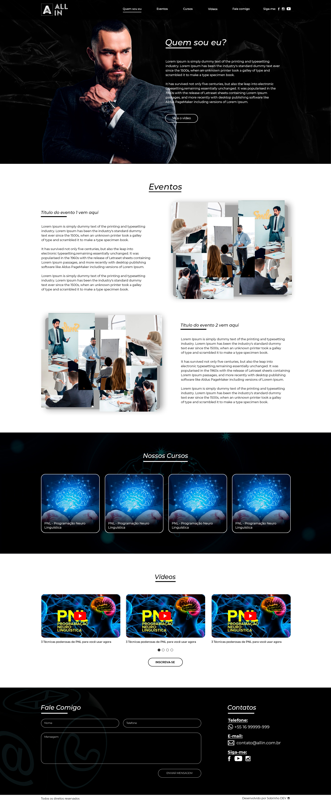

# Landing-page pessoal

Este projeto consiste em uma Landing Page desenvolvida exclusivamente com HTML e CSS. A finalidade principal é servir como um portfólio pessoal, podendo ser adaptada para atender às necessidades de profissionais de diversas áreas.

# Conteúdo
O projeto é composto por uma página única, otimizada para exibir informações relevantes de forma clara e atrativa. A estrutura é construída utilizando as melhores práticas de HTML e CSS, visando a eficiência e elegância do design.

# Personalização
Para personalizar esta Landing Page de acordo com suas necessidades, basta editar o código HTML e CSS fornecido. A estrutura é modular, facilitando a adição ou remoção de seções conforme desejado. Além disso, é possível ajustar cores, fontes e outros elementos visuais para refletir a identidade pessoal ou profissional.

# Instruções de Uso
Faça o download ou clone este repositório.
Abra o arquivo index.html em seu navegador para visualizar a página.
Personalize o conteúdo e o estilo conforme necessário, fazendo alterações no código-fonte.
Hospede a Landing Page em um servidor da sua escolha ou utilize serviços de hospedagem gratuita para torná-la acessível online.
Contribuições
Contribuições são bem-vindas! Sinta-se à vontade para propor melhorias, corrigir problemas ou adicionar novos recursos. Basta criar um fork do repositório, fazer as modificações desejadas e enviar um pull request.

# Layout

